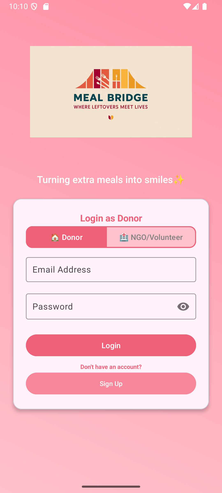
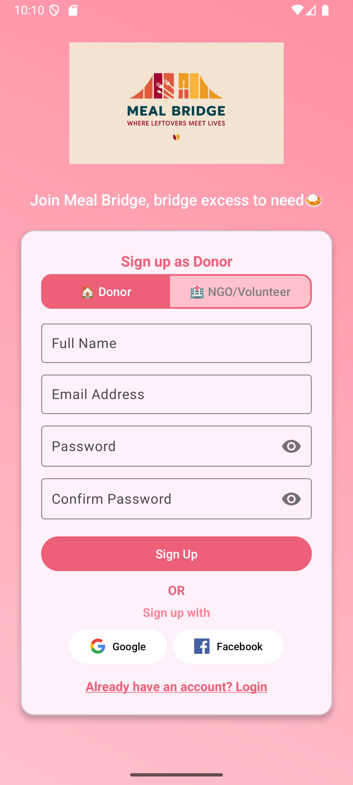
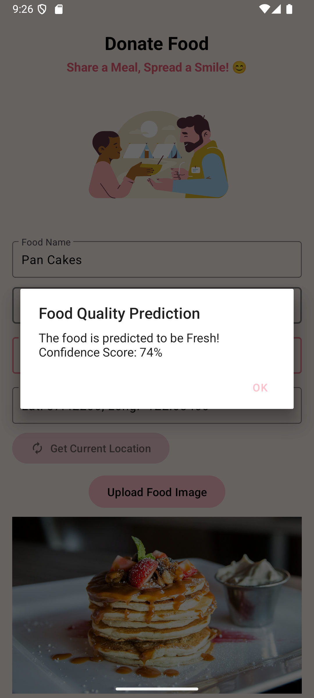
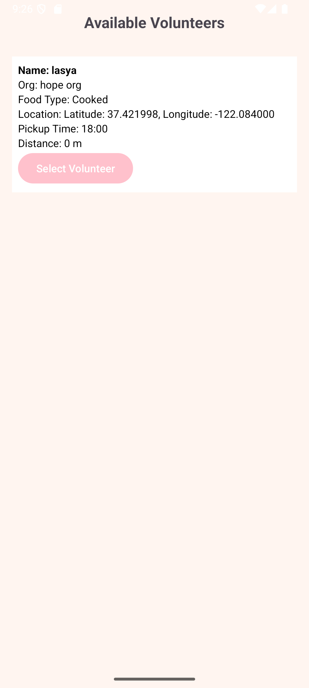
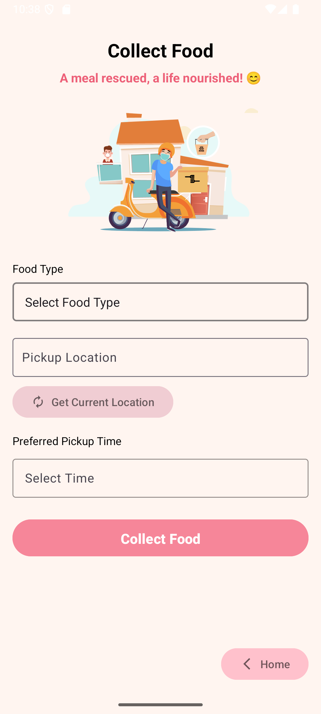
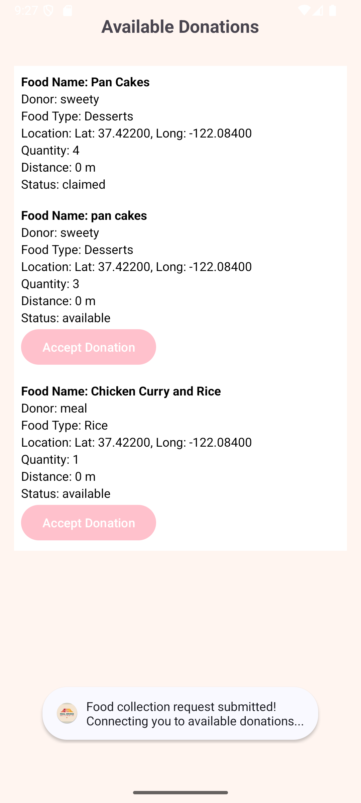

# 🍽️ MealBridge

MealBridge is a mobile application built to connect food donors with NGOs and volunteers who collect and distribute surplus food to those in need. The goal is to reduce food waste and bridge the gap between availability and hunger.

---

## 🚀 Features

- 🤝 Register as a **Donor**, **Volunteer**, or **NGO**
- 📍 View nearby donations (sorted by distance)
- 🍛 Match based on **food type**, **pickup time**, and **location**
- 🔔 Real-time status updates and notifications
- 🧠 Machine Learning integration to assess food quality before pickup

---

## 📷 Screenshots

<p float="left">
  
  
  
  
  
  
  
  
</p>


---

## 🛠️ Tech Stack

- **Frontend**: Kotlin (Android Studio)
- **Backend**: Firebase (Cloud-hosted)
- **ML Model**: MobileNetV2 with TensorFlow & Keras
- **Image Storage**: Cloudinary
- **Realtime DB**: Firebase Firestore (for some modules)

---

## 🔧 Setup & Installation

1. Clone the repository:
   ```bash
   git clone https://github.com/Pranavi1609/MealBridge.git

