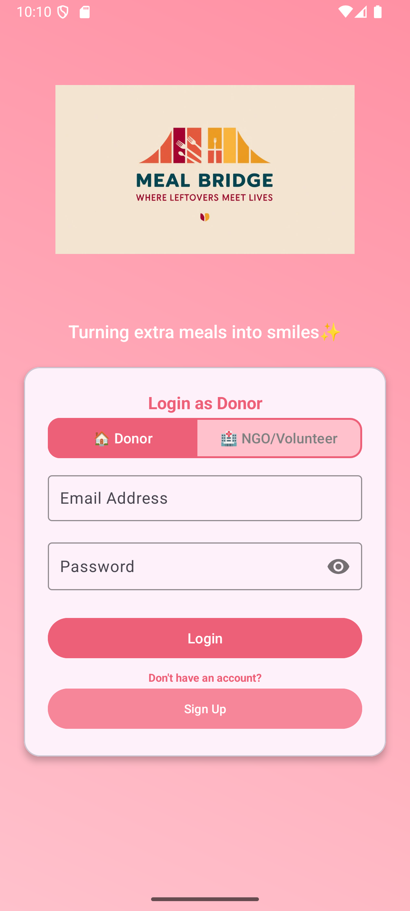
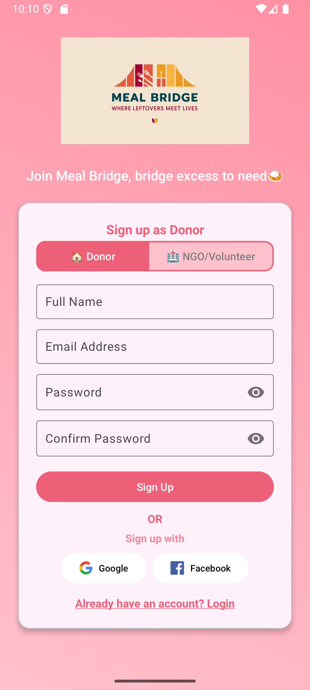
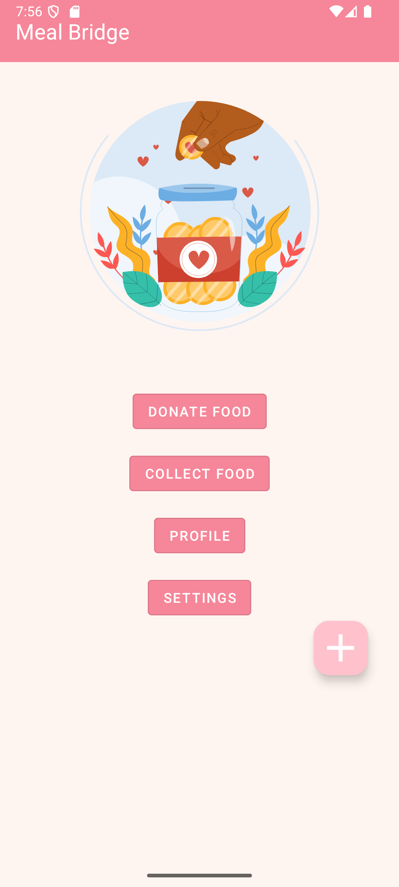
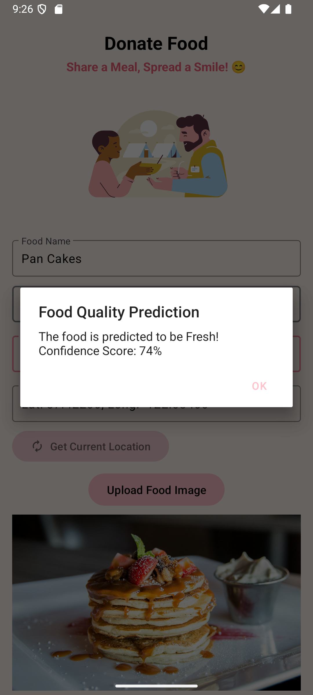
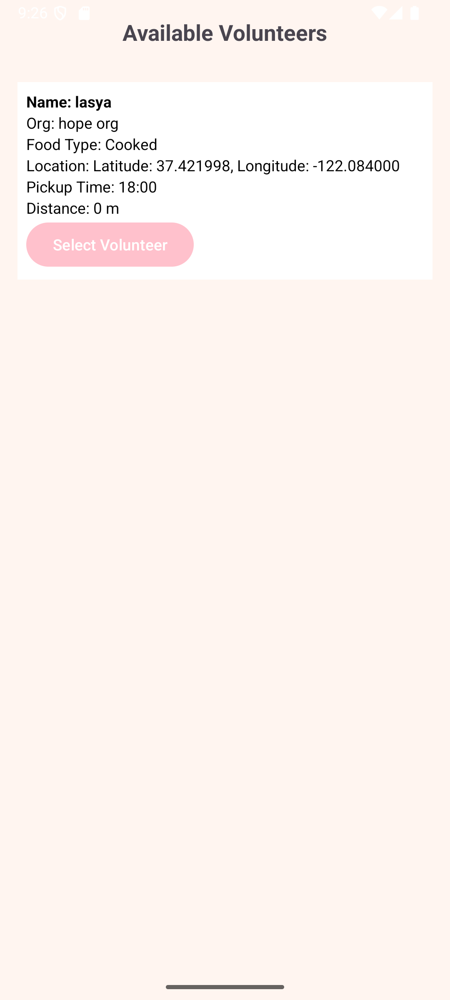
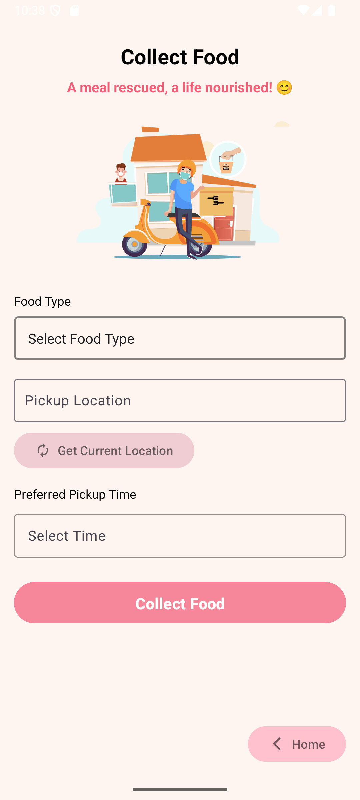
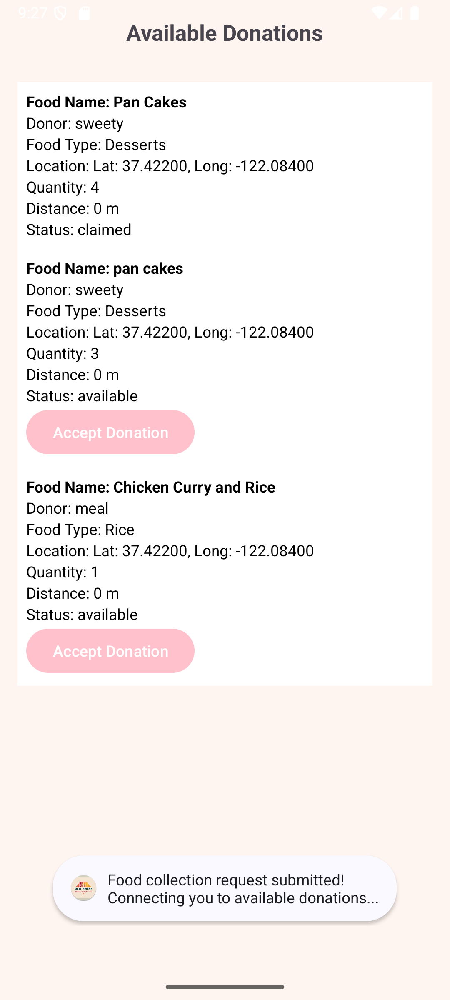

# 🍽️ MealBridge

MealBridge is a mobile application built to connect food donors with NGOs and volunteers who collect and distribute surplus food to those in need. The goal is to reduce food waste and bridge the gap between availability and hunger.

---

## 🚀 Features

- 🤝 Register as a **Donor**, **Volunteer**, or **NGO**
- 📍 View nearby donations (sorted by distance)
- 🍛 Match based on **food type**, **pickup time**, and **location**
- 🔔 Real-time status updates and notifications
- 🧠 Machine Learning integration to assess food quality before pickup

---

## 📷 Screenshots

<p float="left">
  
  
  
  
  
  
  
  
</p>


---

## 🛠️ Tech Stack

- **Frontend**: Kotlin, Java (Android Studio)
- **Backend**: Firebase (Cloud-hosted)
- **ML Model**: MobileNetV2 with TensorFlow & Keras
- **Image Storage**: Cloudinary
- **Realtime DB**: Firebase Firestore (for some modules)

---

## 🔧 Setup & Installation

1. Clone the repository:
   ```bash
   git clone https://github.com/Pranavi1609/MealBridge.git
   ```

2. Navigate to the project directory:
   ```bash
   cd MealBridge
   ```

3. Open the project in Android Studio:
   - Launch Android Studio
   - Select "Open an Existing Project"
   - Navigate to the MealBridge directory and click "Open"

4. Configure Firebase:
   - Create a Firebase project at [Firebase Console](https://firebase.google.com/)
   - Add an Android app to your project
   - Download `google-services.json` and place it in the `app/` directory
   - Enable Authentication, Firestore Database, Cloud Storage, and Cloud Messaging

5. Sync project dependencies:
   ```bash
   # Android Studio will automatically sync Gradle files
   # If manual sync is needed:
   ./gradlew clean build
   ```

6. Run the application:
   - Connect your Android device or start an emulator
   - Click the "Run" button in Android Studio
   - Grant necessary permissions when prompted

---

## 📋 Prerequisites

- **Android Studio** (latest version)
- **Java Development Kit (JDK)** 17+
- **Android SDK** API 28+
- **Git** installed and configured
- **Android device** or emulator for testing

---

## 📱 Key Dependencies

```gradle
dependencies {
    // Firebase
    implementation platform('com.google.firebase:firebase-bom:32.7.0')
    implementation 'com.google.firebase:firebase-auth-ktx'
    implementation 'com.google.firebase:firebase-firestore-ktx'
    implementation 'com.google.firebase:firebase-storage-ktx'
    implementation 'com.google.firebase:firebase-messaging-ktx'
    
    // TensorFlow Lite for ML
    implementation 'org.tensorflow:tensorflow-lite:2.13.0'
    implementation 'org.tensorflow:tensorflow-lite-support:0.4.4'
    
    // Material Design 3
    implementation 'com.google.android.material:material:1.11.0'
}
```

---

## 🔑 Required Permissions

```xml
<uses-permission android:name="android.permission.INTERNET" />
<uses-permission android:name="android.permission.CAMERA" />
<uses-permission android:name="android.permission.ACCESS_FINE_LOCATION" />
<uses-permission android:name="android.permission.READ_EXTERNAL_STORAGE" />
```

---

## 🎯 How to Use

### For Donors
1. Register as a Donor
2. Add food donation with photos and details
3. Use ML scanning to assess food quality
4. Set pickup time and location
5. Track donation status in real-time

### For Volunteers/NGOs
1. Register with your role
2. Browse nearby donations
3. Claim donations for collection
4. Update status during pickup/delivery
5. Coordinate with donors

---

## 🐛 Troubleshooting

- **Gradle sync failed**: Run `./gradlew clean build`
- **Firebase issues**: Ensure `google-services.json` is in the correct location
- **ML model errors**: Verify `.tflite` file is in `app/src/main/assets/`
- **Permission denied**: Check runtime permissions are properly handled

---

**Made with ❤️ to reduce food waste and fight hunger**
