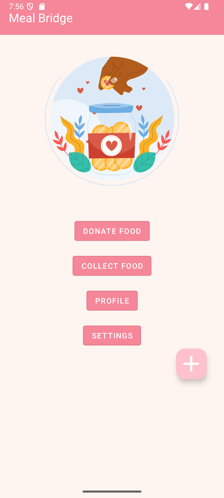

# 🍽️ MealBridge

MealBridge is a mobile application built to connect food donors with NGOs and volunteers who collect and distribute surplus food to those in need. The goal is to reduce food waste and bridge the gap between availability and hunger.

---

## 🚀 Features

- 🤝 Register as a **Donor**, **Volunteer**, or **NGO**
- 📍 View nearby donations (sorted by distance)
- 🍛 Match based on **food type**, **pickup time**, and **location**
- 🔔 Real-time status updates and notifications
- 🧠 Machine Learning integration to assess food quality before pickup

---

## 📷 Screenshots

<p float="left">
  
  
  
  
  
  
  
  
</p>


---

## 🛠️ Tech Stack

- **Frontend**: Kotlin (Android Studio)
- **Backend**: Firebase (Cloud-hosted)
- **ML Model**: MobileNetV2 with TensorFlow & Keras
- **Image Storage**: Cloudinary
- **Realtime DB**: Firebase Firestore (for some modules)

---

## 🔧 Setup & Installation

1. Clone the repository:
   ```bash
   git clone https://github.com/Pranavi1609/MealBridge.git

🔧 Setup & Installation
Clone the repository:

bash
git clone https://github.com/Pranavi1609/MealBridge.git
Navigate to the project directory:

bash
cd MealBridge
Open the project in Android Studio:

Launch Android Studio

Select "Open an Existing Project"

Navigate to the MealBridge directory and click "Open"

Configure Firebase:

Create a Firebase project at Firebase Console

Add an Android app to your project

Download google-services.json and place it in the app/ directory

Enable Authentication, Firestore Database, Cloud Storage, and Cloud Messaging

Sync project dependencies:

bash
# Android Studio will automatically sync Gradle files
# If manual sync is needed:
./gradlew clean build
Run the application:

Connect your Android device or start an emulator

Click the "Run" button in Android Studio

Grant necessary permissions when prompted

📋 Prerequisites
Android Studio (latest version)

Java Development Kit (JDK) 17+

Android SDK API 28+

Git installed and configured

Android device or emulator for testing

📱 Key Dependencies
text
dependencies {
    // Firebase
    implementation platform('com.google.firebase:firebase-bom:32.7.0')
    implementation 'com.google.firebase:firebase-auth-ktx'
    implementation 'com.google.firebase:firebase-firestore-ktx'
    implementation 'com.google.firebase:firebase-storage-ktx'
    implementation 'com.google.firebase:firebase-messaging-ktx'
    
    // TensorFlow Lite for ML
    implementation 'org.tensorflow:tensorflow-lite:2.13.0'
    implementation 'org.tensorflow:tensorflow-lite-support:0.4.4'
    
    // Material Design 3
    implementation 'com.google.android.material:material:1.11.0'
}
🔑 Required Permissions
xml
<uses-permission android:name="android.permission.INTERNET" />
<uses-permission android:name="android.permission.CAMERA" />
<uses-permission android:name="android.permission.ACCESS_FINE_LOCATION" />
<uses-permission android:name="android.permission.READ_EXTERNAL_STORAGE" />
🎯 How to Use
For Donors
Register as a Donor

Add food donation with photos and details

Use ML scanning to assess food quality

Set pickup time and location

Track donation status in real-time

For Volunteers/NGOs
Register with your role

Browse nearby donations

Claim donations for collection

Update status during pickup/delivery

Coordinate with donors

🐛 Troubleshooting
Gradle sync failed: Run ./gradlew clean build

Firebase issues: Ensure google-services.json is in the correct location

ML model errors: Verify .tflite file is in app/src/main/assets/

Permission denied: Check runtime permissions are properly handled

🤝 Contributing
Fork the repository

Create a feature branch (git checkout -b feature/AmazingFeature)

Commit your changes (git commit -m 'Add AmazingFeature')

Push to the branch (git push origin feature/AmazingFeature)

Open a Pull Request

📄 License
This project is licensed under the MIT License - see the LICENSE file for details.

📞 Support
For issues and questions:

Create an issue on GitHub

Email: support@mealbridge.com

Made with ❤️ to reduce food waste and fight hunger

